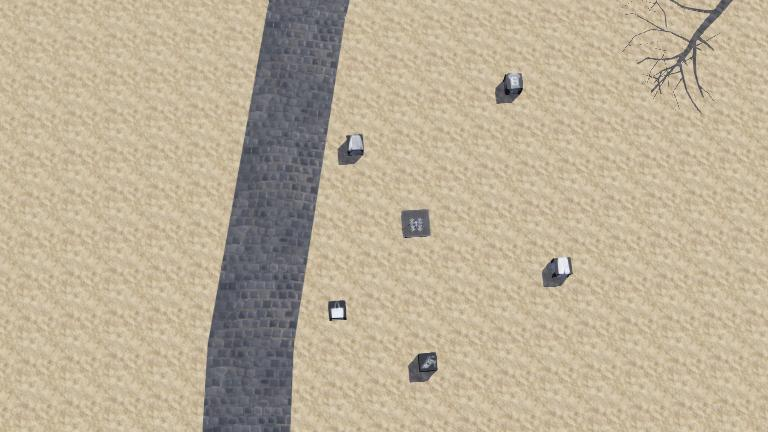
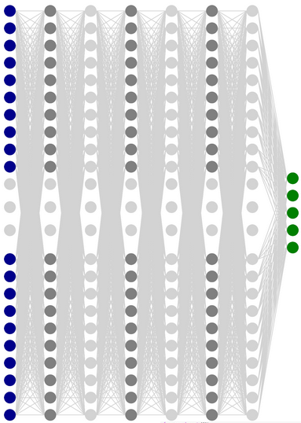
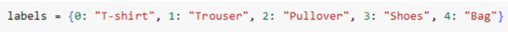

# Quad-Clothing-Classifier
## Project Overview 
In this project, a controller was developed for the quad robot in Webots to go on top of the boxes in the world and take pictures of them. The boxes contain 5 types of clothes. Then it gives the captured image to a convolutional neural network to determine the class of the object inside the box.

# Convolutional Neural Network (CNN) for Fashion-MNIST Clothing Classification

This code implements a Convolutional Neural Network (CNN) for Fashion-MNIST Clothing Classification using Keras with TensorFlow backend. The model is designed for classifying images with a shape of (28, 28, 1).
## Model Architecture

### Layers
1. **Convolutional Layer 1:**
   - Filters: 32
   - Kernel Size: (3, 3)
   - Activation Function: ReLU
   - Input Shape: (28, 28, 1)
   - Batch Normalization: Applied for faster and more stable training

2. **Convolutional Layer 2:**
   - Filters: 32
   - Kernel Size: (3, 3)
   - Activation Function: ReLU
   - Batch Normalization: Applied
   - Max Pooling Layer: (2, 2)
   - Dropout: 25% (To prevent overfitting)

3. **Convolutional Layer 3:**
   - Filters: 64
   - Kernel Size: (3, 3)
   - Activation Function: ReLU
   - Batch Normalization: Applied
   - Dropout: 25%

4. **Convolutional Layer 4:**
   - Filters: 128
   - Kernel Size: (3, 3)
   - Activation Function: ReLU
   - Batch Normalization: Applied
   - Max Pooling Layer: (2, 2)
   - Dropout: 25%

### Interpretation Layers
5. **Flatten Layer:**
   - Flattens the output for input into dense layers.

6. **Dense Layer 1:**
   - Neurons: 512
   - Activation Function: ReLU
   - Batch Normalization: Applied
   - Dropout: 50% (To prevent overfitting)

7. **Dense Layer 2:**
   - Neurons: 128
   - Activation Function: ReLU
   - Batch Normalization: Applied
   - Dropout: 50%

8. **Output Layer:**
   - Neurons: 5 (Assuming this is a multi-class classification task)
   - Activation Function: Softmax (for probability distribution across classes)

For optimization, we use the Adam optimizer and categorical_crossentropy loss.

## Results
After 100 epochs on the entire dataset with a batch size of 256, the model achieved the following accuracy:
- Test accuracy: 98.7%

Using the sklearn library, we also calculate the confusion matrix and recall and precision scores.

